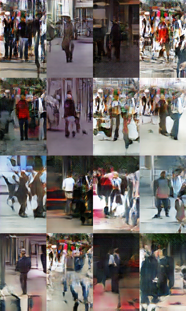

# streetview
Automatically generate and complete the streetview

## DCGAN
- [Unsupervised Representation Learning with Deep Convolutional Generative Adversarial Networks](https://arxiv.org/abs/1511.06434)
- Decode the simple(uniform here) distribution p_z to the images(streetview here) distribution p_data

- How to use: DCGAN_streetview/ 
  `main.py --dataset datasetname --mode train`
- TODO: 
  - GAN-improved
  - VAE

**Now we can pick an arbitrary z~p_z and decode it to a image**

## Completion
- [Semantic Image Inpainting with Perceptual and Contextual Losses](https://arxiv.org/abs/1607.07539)
- Pick the z that fits the original image well

- Minimizing the (Contextual + lamda*Perceptual) loss
- How to use: DCGAN_streetview/ 
  `main.py --dataset datasetname --mode complete`
- TODO: 
  - [poisson blending](http://www.ctralie.com/Teaching/PoissonImageEditing/)

**But what's behind it? Can we encode a image to z?**

## Observation
- related to [Generative Image Modeling using Style and Structure Adversarial Networks](https://arxiv.org/abs/1603.05631)
- Here is another example which focus on pedestrian. In the early training stage, the network seems to decide the *structures or poses* of pedestrians. Then in the late training stage, it only has subtle changes on *texture* according to the current batch.
<figure class="third">
    
    
</figure>
- In the completion stage, it tends to choose those z resulting blurry images
